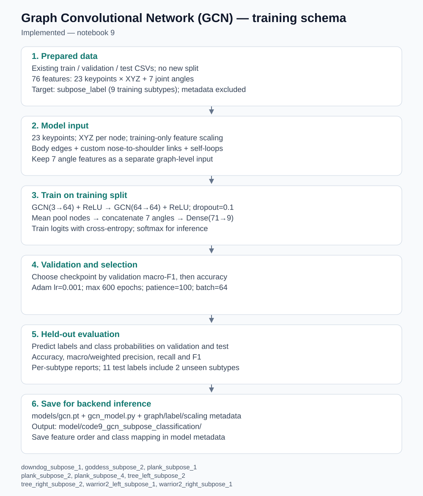
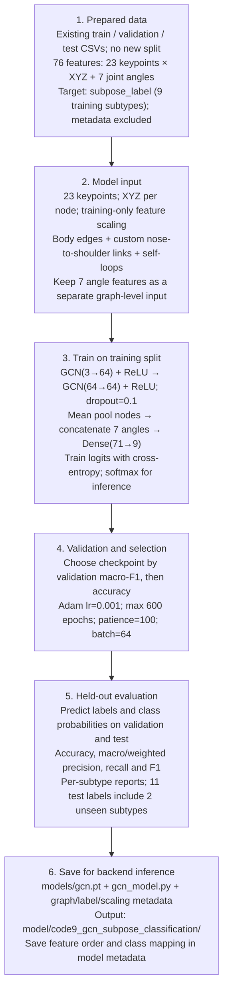

# Graph Convolutional Network (GCN) training schema

Implemented — notebook 9

Classes: downdog_subpose_1, goddess_subpose_2, plank_subpose_1, plank_subpose_2, plank_subpose_4, tree_left_subpose_2, tree_right_subpose_2, warrior2_left_subpose_1, warrior2_right_subpose_1.

Matches the current notebook configuration. The validation winner is selected among the models compared by the notebook; test metrics are descriptive. Model files are inside the output directory’s models/ folder. Best-model metadata identifies the selected model.
